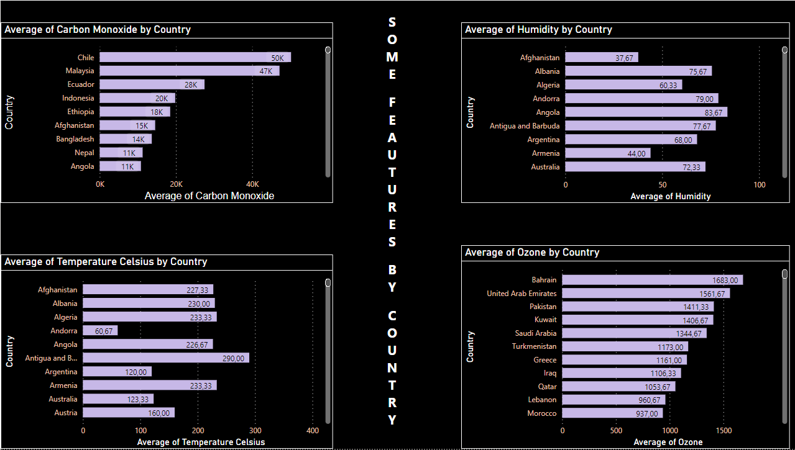

# WEATHER DATA SET

[{width="682"}](https://www.yandex.com.tr/gorsel/search?from=tabbar&img_url=https%3A%2F%2Fcatherineasquithgallery.com%2Fuploads%2Fposts%2F2021-02%2F1613686171_41-p-fon-dlya-prezentatsii-pogoda-43.png&lr=104782&pos=18&rpt=simage&text=weather)

This data set was taken from [Kaggle](https://www.kaggle.com/datasets/nelgiriyewithana/global-weather-repository?select=GlobalWeatherRepository.csv)

## Power BI

{width="730"}

## Preperation

```{r echo = T, results = 'hide',message=FALSE, warning=FALSE}
# Please first download required library
library(tidyverse)
library(ggplot2)
library(dplyr)
library(rvest)
library(stringr)
library(corrplot)

```

## General Information About Data Set

```{r}
dt<-read.csv("C:/Users/gozde/Desktop/wheather/GlobalWeatherRepository.csv")
set.seed(292)
rand_number_1 <- sample(x = 1:585, size = 200)
dt<-dt[rand_number_1,1:41]
summary(dt)
```

-   **country**: Country of the weather data

-   **location_name**: Name of the location (city)

-   **latitude**: Latitude coordinate of the location

-   **longitude**: Longitude coordinate of the location

-   **timezone**: Timezone of the location

-   **last_updated_epoch**: Unix timestamp of the last data update

-   **last_updated**: Local time of the last data update

-   **temperature_celsius**: Temperature in degrees Celsius

-   **temperature_fahrenheit**: Temperature in degrees Fahrenheit

-   **condition_text**: Weather condition description

-   **wind_mph**: Wind speed in miles per hour

-   **wind_kph**: Wind speed in kilometers per hour

-   **wind_degree**: Wind direction in degrees

-   **wind_direction**: Wind direction as a 16-point compass

-   **pressure_mb**: Pressure in millibars

-   **pressure_in**: Pressure in inches

-   **precip_mm**: Precipitation amount in millimeters

-   **precip_in**: Precipitation amount in inches

-   **humidity**: Humidity as a percentage

-   **cloud**: Cloud cover as a percentage

-   **feels_like_celsius**: Feels-like temperature in Celsius

-   **feels_like_fahrenheit**: Feels-like temperature in Fahrenheit

-   **visibility_km**: Visibility in kilometers

-   **visibility_miles**: Visibility in miles

-   **uv_index**: UV Index

-   **gust_mph**: Wind gust in miles per hour

-   **gust_kph**: Wind gust in kilometers per hour

-   **air_quality_Carbon_Monoxide**: Air quality measurement: Carbon Monoxide

-   **air_quality_Ozone**: Air quality measurement: Ozone

-   **air_quality_Nitrogen_dioxide**: Air quality measurement: Nitrogen Dioxide

-   **air_quality_Sulphur_dioxide**: Air quality measurement: Sulphur Dioxide

-   **air_quality_PM2.5**: Air quality measurement: PM2.5

-   **air_quality_PM10**: Air quality measurement: PM10

-   **air_quality_us-epa-index**: Air quality measurement: US EPA Index

-   **air_quality_gb-defra-index**: Air quality measurement: GB DEFRA Index

-   **sunrise**: Local time of sunrise

-   **sunset**: Local time of sunset

-   **moonrise**: Local time of moonrise

-   **moonset**: Local time of moonset

-   **moon_phase**: Current moon phase

-   **moon_illumination**: Moon illumination percentage

Above information was taken from [Kaggle](country:%20Country%20of%20the%20weather%20data%20location_name:%20Name%20of%20the%20location%20(city)%20latitude:%20Latitude%20coordinate%20of%20the%20location%20longitude:%20Longitude%20coordinate%20of%20the%20location%20timezone:%20Timezone%20of%20the%20location%20last_updated_epoch:%20Unix%20timestamp%20of%20the%20last%20data%20update%20last_updated:%20Local%20time%20of%20the%20last%20data%20update%20temperature_celsius:%20Temperature%20in%20degrees%20Celsius%20temperature_fahrenheit:%20Temperature%20in%20degrees%20Fahrenheit%20condition_text:%20Weather%20condition%20description%20wind_mph:%20Wind%20speed%20in%20miles%20per%20hour%20wind_kph:%20Wind%20speed%20in%20kilometers%20per%20hour%20wind_degree:%20Wind%20direction%20in%20degrees%20wind_direction:%20Wind%20direction%20as%20a%2016-point%20compass%20pressure_mb:%20Pressure%20in%20millibars%20pressure_in:%20Pressure%20in%20inches%20precip_mm:%20Precipitation%20amount%20in%20millimeters%20precip_in:%20Precipitation%20amount%20in%20inches%20humidity:%20Humidity%20as%20a%20percentage%20cloud:%20Cloud%20cover%20as%20a%20percentage%20feels_like_celsius:%20Feels-like%20temperature%20in%20Celsius%20feels_like_fahrenheit:%20Feels-like%20temperature%20in%20Fahrenheit%20visibility_km:%20Visibility%20in%20kilometers%20visibility_miles:%20Visibility%20in%20miles%20uv_index:%20UV%20Index%20gust_mph:%20Wind%20gust%20in%20miles%20per%20hour%20gust_kph:%20Wind%20gust%20in%20kilometers%20per%20hour%20air_quality_Carbon_Monoxide:%20Air%20quality%20measurement:%20Carbon%20Monoxide%20air_quality_Ozone:%20Air%20quality%20measurement:%20Ozone%20air_quality_Nitrogen_dioxide:%20Air%20quality%20measurement:%20Nitrogen%20Dioxide%20air_quality_Sulphur_dioxide:%20Air%20quality%20measurement:%20Sulphur%20Dioxide%20air_quality_PM2.5:%20Air%20quality%20measurement:%20PM2.5%20air_quality_PM10:%20Air%20quality%20measurement:%20PM10%20air_quality_us-epa-index:%20Air%20quality%20measurement:%20US%20EPA%20Index%20air_quality_gb-defra-index:%20Air%20quality%20measurement:%20GB%20DEFRA%20Index%20sunrise:%20Local%20time%20of%20sunrise%20sunset:%20Local%20time%20of%20sunset%20moonrise:%20Local%20time%20of%20moonrise%20moonset:%20Local%20time%20of%20moonset%20moon_phase:%20Current%20moon%20phase%20moon_illumination:%20Moon%20illumination%20percentage)

## Plot of Weather Data

Since this data set so big to see any pattern we use small sample.

set.seed(291)

rand_number_2 \<- sample(x = 1:200, size = 15)

dt_plot\<-dt[rand_number_2,1:41]

```{r}
set.seed(291)
rand_number_2 <- sample(x = 1:200, size = 15)
dt_plot<-dt[rand_number_2,1:41]
```

### Temperature of Celsius by Country

```{r fig.dim = c(10, 8) }
ggplot(data = dt_plot, aes(x = country, y = temperature_celsius, fill = country)) +
  geom_bar(stat = "identity", position = "dodge",show.legend = F)+
  labs(title="Temperature of Celsius by Country")+
  xlab("Country")+ylab("Temperature of Celcius")

```

As we can understand from this graph between these 15 countries the hottest country is Kuwait. The coldest country is Ecuador.

-   According to [NBC News](https://www.nbcnews.com/science/environment/kuwait-worlds-hottest-places-lags-climate-action-rcna20830) : Kuwait reached a scorching temperature of 53.2 degrees Celsius (127.7 degrees Fahrenheit), making it among the hottest places on earth.

    ### Wind Speed in Miles per hour by Country

    ```{r fig.dim = c(10, 8)}
    ggplot(data = dt_plot, aes(x = country, y = wind_mph, fill = country)) +
      geom_bar(stat = "identity", position = "dodge")+
      labs(title=" Wind Speed in Miles per hour by Country")+
      xlab("Country")+ylab("Wind Speed in Miles per hour")+theme_minimal()
    ```

    Senegal is the windiest place between these 15 countries.

    ### Humidity by Country

    ```{r fig.dim = c(10, 8)}
    ggplot(data = dt_plot, aes(x = country, y = humidity, fill = country)) +
      geom_bar(stat = "identity", position = "dodge")+
      labs(title="Humidity by Country")+
      xlab("Country")+ylab("Humidity")+theme_minimal()


    ```

All countries are mostly high except Kuwait. Also, as we discussed, Kuwait is a hot country, so this affects the humidity.

### 

### Feels-like temperature in Celsius by Country

```{r fig.dim = c(10, 8)}
ggplot(data = dt_plot, aes(x = country, y =feels_like_celsius , fill = country)) +
  geom_bar(stat = "identity", position = "dodge")+
  labs(title="Feeling Temperature in Celsius by Country")+
  xlab("Country")+ylab("Feeling Temperature in Celsius")+theme_minimal()


```

\
As we excepted Kuwait's feels-like temperature is high since it's humidity and normal temperature is high.

### Ultraviolet Index by Country

According to the [Wikipedia](https://en.wikipedia.org/wiki/Ultraviolet_index) :

The **ultraviolet index**, or **UV index**, is an international standard measurement of the strength of the [sunburn](https://en.wikipedia.org/wiki/Sunburn "Sunburn")-producing [ultraviolet](https://en.wikipedia.org/wiki/Ultraviolet "Ultraviolet") (UV) [radiation](https://en.wikipedia.org/wiki/Radiation "Radiation") at a particular place and time.

```{r fig.dim = c(10, 8)}
ggplot(data = dt_plot, aes(x = country, y =uv_index , fill = country)) +
  geom_bar(stat = "identity", position = "dodge")+
  labs(title="Ultraviolet Index by Country")+
  xlab("Country")+ylab("Ultraviolet Index")+theme_minimal()

```

Oman has the most uv_index.

### Ozone by Country

```{r fig.dim = c(10, 8)}
ggplot(data = dt_plot, aes(x = country, y =air_quality_Ozone , fill = country)) +
  geom_bar(stat = "identity", position = "dodge")+
  labs(title="Ozone by Country")+
  xlab("Country")+ylab("Ozone")

```

Kuwait's ozone level is really high. This is bad because ozone is really harmful for people's health.

According to the [Answer More](https://www.answersmore.com/what-happens-if-there-is-too-much-ozone/) :

Ozone makes people more sensitive to allergens---the most common triggers for asthma attacks. Also, asthmatics may be more severely affected by reduced lung function and airway inflammation.

### Nitrogen dioxide by Country

```{r fig.dim = c(10, 8)}
ggplot(data = dt_plot, aes(x = country, y =air_quality_Nitrogen_dioxide , fill = country)) +
  geom_bar(stat = "identity", position = "dodge",show.legend = F)+
  labs(title="Nitrogen Dioxide by Country")+
  xlab("Country")+ylab("Nitrogen Dioxide")+theme_minimal()

```

### Sulphur Dioxide by Country

```{r fig.dim = c(10, 8)}
ggplot(data = dt_plot, aes(x = country, y =air_quality_Sulphur_dioxide , fill = country)) +
  geom_bar(stat = "identity", position = "dodge",show.legend = F)+
  labs(title="Sulphur Dioxide by Country")+
  xlab("Country")+ylab("Sulphur Dioxide")
```

### EPA Index by country

```{r fig.dim = c(10, 8)}

ggplot(data = dt_plot, aes(x = country, y = air_quality_us.epa.index, fill = country)) +
  geom_bar(stat = "identity", position = "dodge") +
  labs(title = "EPA Index by Country") +
  xlab("Country") + ylab("EPA Index") +
  theme_minimal()


```

For more information about US EPA Index. Look at the below image.


## **Correlation matrix: correlations for all variables**

If you do not have information about correlation matrix. Here is the general summary information:


```{r}
dt_cor<-dt[c(8,11,15,19,21,25,28,29,30,31,34)]
round(cor(dt_cor),
  digits = 2 # rounded to 2 decimals
)

```

To be more easy to read, let's make as a plot.

```{r fig.dim = c(10, 8)}
corrplot(cor(dt_cor),
  method = "number",
  type = "upper" # show only upper side
)
```

Time to interpretation:

As we can guess there is a high positive correlation between temperature Celsius and feels like Celsius.

Also, Carbon monoxide and the US EPA Index are highly positively correlated to each other.

Carbon monoxide and nitrogen dioxide are moderately positively correlated to each other.

Pressure mb and feels like Celsius are moderately negatively correlated to each other.

Also, Ozone and humidity are moderately negatively correlated.

## Linear Regression

If you do not have information about linear regression. Here is the general summary information:

{width="716"}

Once we have identified two variables that are correlated, we would like to model this relationship. We want to use one variable as a **predictor** or **explanatory** variable to explain the other variable, the **response** or **dependent** variable. In order to do this, we need a good relationship between our two variables. The model can then be used to predict changes in our response variable. A strong relationship between the predictor variable and the response variable leads to a good model.

### Ozone and Humidity

```{r}
linear1 <- lm( air_quality_Ozone~ humidity, data=dt_plot)
linear1
```

Ozone=120.740+(-1.072)\*Humidity

### Carbon Monoxide and Nitrogen Dioxide

```{r}
linear2 <- lm( air_quality_Carbon_Monoxide~air_quality_Nitrogen_dioxide , data=dt_plot)
linear2
```

Carbon Monoxide=153.10+40.41\*Nitrogen Dioxide

### Pressure mb and Feels Like Celsius

```{r}
linear3 <- lm( pressure_mb~ feels_like_celsius, data=dt_plot)
linear3

```

Pressure mb=1027.0463-0.5809\*(Feels Like Celsius)

### Carbon Monoxide and the US EPA Index

```{r}
linear4 <- lm( air_quality_us.epa.index~ air_quality_Carbon_Monoxide, data=dt_plot)
linear4
```

EPA Index=1.4165+(0.00019)\*Carbon Monoxide

### Temperature Celsius and Feels Like Celsius

```{r}
linear5 <- lm( feels_like_celsius~temperature_celsius , data=dt_plot)
linear5
```

Feels Like Celsius=(-3.469)+1.224\*Temperature Celsius
